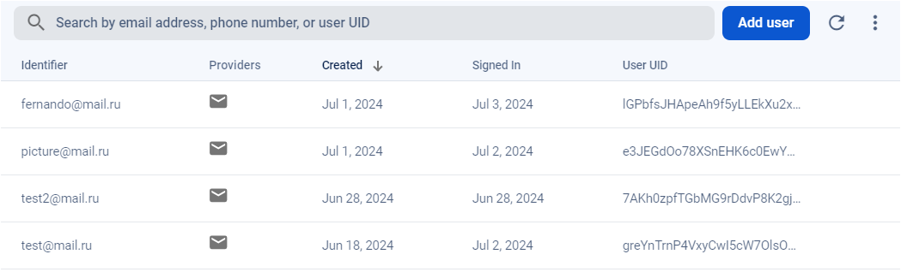
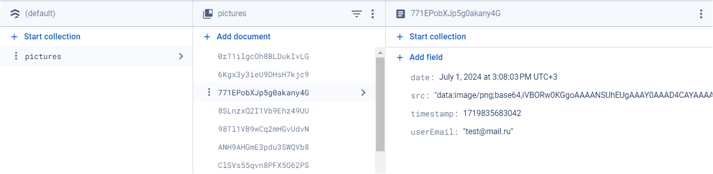

# [Mini-Paint](https://mini-paint-9b3d3.web.app/)

## 1. Task

The essence of the application: a gallery of user images with built-in graphics editor. The application consists of 3 parts:

1. Authorization / registration; Sign in and Register are 2 different pages, respectively, different routes in the application.

2. View the feed of the latest published images, implementation filtering by specific user.

3. The image creation page on Canvas is a mini-analog of the built-in one Paint programs.

When creating an image, the user should be able to select a brush different width, its color, and draw in a certain area. This should include
the ability to draw simple shapes: line, circle, rectangle. You can use the online editor as a guide and example for application design
Vectr images. It has the ability to use without registration. The entire state of the application, saving and updating data, authorization is required implement via Firebase. To complete the task, you can use your personal Google account.

### Requirements:

(https://drive.google.com/file/d/19cb4whI_HUVPzuaPyaj5r6hGotIVnhho/view)

1. Requires React-Redux/Vuex for React/Vue.

2. TypeScript is required.

3. For routing in an application in React and Vue, you can use third-party libraries
   If the user is not authorized, he should not be allowed to the page for creating or viewing tasks.

4. Before development, you need to configure ESLint for the application. As an add-on, you can configure Prettier and link it with ESLint. It will be an additional advantage to implement a pre-commit hook, which will not allow pushing to the repository if the application has ESLint errors.

5. Competent work with the database. If possible, the client should make as few requests as possible. A trivial example of not the most optimal use: make a separate request for tasks for each day. That is, for 30 days of the month, 30 requests fly away.

6. Writing documentation for the project; in the project README file before Upon completion of the assignment, brief documentation must be written English or Russian

7. Handling errors from the server: if the user tries to log in with incorrect data, Firebase will return an error, and this should be displayed to the user in the form of some Toast

8. Implemented Theme management. The ability to easily change the color scheme of the application from within the application (you need to implement switches for the user).

9. Implementation of drawing more complex basic shapes (star,polygon).

## 2. How to run the app

Clone the repository:

```sh
$ git clone
```

Run the app with any server you use, for example, "Live Server"

Install dependencies:

```sh
$ npm install
```

Compile and Hot-Reload for Development:

```sh
$ npm run dev
```

Compile and Minify for Production:

```sh
$ npm run build
```

## 3. Results

All task's requirements were done, also created scroll pagination of pictures.

## 4. Technologies

- Vue 3, TypeScript, Pinia(state management), Vue Router, CSS
- Firebase, ESLint, Prettier, Husky

## 5. Database Snapshots

Structure of users and data in firebase:





## 6. Structure of the project:

In the root folder are main folders and files of the app, including `index.html`, to configure the app.

`src` (Source) - contains the source code of the project. It includes subdirectories for different types of source files along with the main source files that drive the application's functionality. It has `api`, `assets`, `components`, `composables`, `models`, `firebase`, `router`, `stores`, `utils` folders and main files for initializing the app.

`api` - files for requests to Firebase.

`assets` - has logo and stylesheets files.

`components` - has components and modules of the application. It includes subdirectories further categorizing different types of folders' components used in the application: auth, views, loader.

`composables` - includes composable for logic of loading and painting in canvas.

`firebse` - initializing the firebase database and auth.

`icons` - includes icons, used in the app.

`models` - holds models of types for objects.

`router` - include file responsible for routing of the app.

`stores` - includes global stores of the app, theme and user.

`utils` - utility modules or helper functions used across the project.
